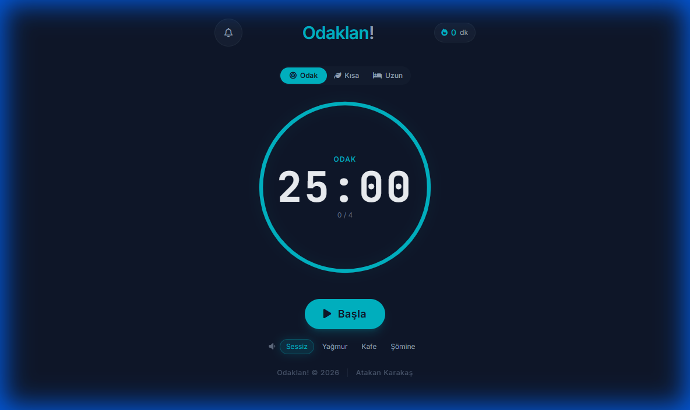

# Odaklan! 🎯

**Türkçe Pomodoro Zamanlayıcı** — Odaklanmanı artır, verimliliğini takip et.



## ✨ Özellikler

### ⏱️ Pomodoro Zamanlayıcı
- **25 dakika odak** + **5 dakika kısa mola** + **15 dakika uzun mola**
- Her 4 pomodoro'dan sonra otomatik uzun mola
- Manuel mod seçimi (istediğin zaman mola alabilirsin)
- Görsel ilerleme halkası

### 📊 İstatistikler
- **Günlük odaklanma süresi** takibi
- **Pomodoro sayacı** (sayfa yenilense bile korunur)
- **Son 7 gün geçmişi** ile haftalık performans
- Tıklanabilir istatistik paneli

### 🎨 Poster Oluşturucu
- Çalışmanızı **Instagram Story** veya **Feed** formatında paylaşın
- Motivasyon sözleri ile zenginleştirilmiş posterler
- Tek tıkla indirme

### 🔔 Bildirimler
- Tarayıcı bildirimleri ile uyarı (izin gerektirir)
- Mod'a özel bildirim mesajları
- Sesli uyarılar

### 🎵 Ambiyans Sesleri
- **Sessiz** | **Yağmur** | **Kafe** | **Şömine**
- Odaklanmayı artıran arka plan sesleri

### 📱 Tam Responsive
- Mobil, tablet ve masaüstü uyumlu
- PWA desteği (Ana ekrana eklenebilir)

---

## 🚀 Kurulum

### Yerel Kullanım
```bash
# Projeyi klonlayın
git clone https://github.com/yourusername/odaklan.git

# Klasöre gidin
cd odaklan

# index.html'i tarayıcınızda açın
# Ya da basit bir HTTP sunucusu başlatın:
npx serve .
```

### Canlı Demo
[🔗 Odaklan! Demo](#) <!-- Kendi URL'nizi ekleyin -->

---

## 📁 Proje Yapısı

```
Odaklan!/
├── index.html      # Ana uygulama (tek dosya)
├── screenshot.png  # Ekran görüntüsü
├── README.md       # Bu dosya
└── sounds/         # Ses dosyaları (opsiyonel)
```

---

## 🛠️ Teknolojiler

- **HTML5** — Yapı
- **Tailwind CSS** (CDN) — Stil
- **Vanilla JavaScript** — Mantık
- **LocalStorage** — Veri kalıcılığı
- **Web Notifications API** — Bildirimler
- **html2canvas** — Poster oluşturma

---

## 📖 Kullanım

1. **Mod Seç:** Odak, Kısa Mola veya Uzun Mola
2. **Başla:** Timer'ı başlat
3. **Çalış:** Odaklan ve zamanı takip et
4. **Mola:** Pomodoro bitince otomatik mola moduna geçer
5. **İstatistikler:** Sağ üstteki süreye tıkla → Detaylı istatistikler
6. **Poster:** İstatistikler > Poster Oluştur → Paylaş!

---

## 🔧 Özelleştirme

`index.html` içindeki sabitleri değiştirerek süreleri ayarlayabilirsiniz:

```javascript
const POMODORO_DURATION = 25 * 60;      // 25 dakika (saniye)
const SHORT_BREAK_DURATION = 5 * 60;    // 5 dakika
const LONG_BREAK_DURATION = 15 * 60;    // 15 dakika
const POMODOROS_UNTIL_LONG_BREAK = 4;   // Uzun mola için pomodoro sayısı
```

---

## 📄 Lisans

MIT License — Özgürce kullanın, değiştirin, paylaşın.

---

## 👨‍💻 Geliştirici

**Atakan Karakaş**

---

<p align="center">
  <sub>🍅 Odaklanın, başarın! 🍅</sub>
</p>
